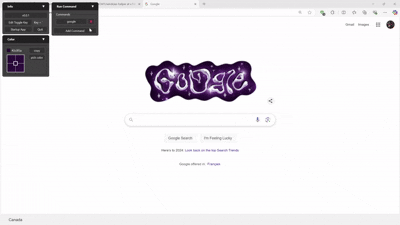

# PySide6 Helper Tool for Windows

## Overview

This project is a desktop application built using **PySide6**, designed to serve as a versatile helper tool for Windows. The tool provides an intuitive and user-friendly interface to perform a variety of tasks and enhance productivity.

## Features

- **Color Picker:** Select and copy HEX color values on your screen.
- **CMD Runner:** Save and execute custom command line instructions.
- **Chance:** Flip a coin, roll a dice
- **Customize:** Create and Add custom windows without rebuilding
- **Interface:** Runs at top layer and toggleable through hotkey. Adjustable layouts to fit your preferences.

  
  

## Installation

### Option 1: Installing from ZIP and Running the Executable

To quickly set up and run the application:

1. **Download and Extract the ZIP file:**

   - Download the latest `windows-helper.zip` file from the releases page.
   - Extract the contents to your desired location on your computer.

2. **Run the Application:**
   - Navigate to the extracted folder.
   - Double-click on `windows-helper.exe` to launch the application.

### Option 2: Running Locally and Building the Executable

To run the application locally or build it as a standalone executable, follow these steps:

1. **Clone the repository:**

   ```bash
   git clone https://github.com/LeoCh01/windows-helper.git
   ```

2. **Set up the Python environment:**

   - Create a virtual environment in project directory:
     ```bash
     python -m venv venv
     ```
   - Activate the virtual environment:
     ```bash
     venv\Scripts\activate
     ```

3. **Install the required dependencies:**

   ```bash
   pip install -r requirements.txt
   ```

4. **Run the application locally:**

   - Once the environment is set up, you can run the app by executing:
     ```bash
     python windows-helper.py
     ```

5. **Convert to Executable (Optional):**
   - If you want to convert the application into a standalone `.exe` file, run the following command:
     ```bash
     pyinstaller windows-helper.spec
     ```
   - The `.exe` file will be generated in the `dist` folder inside the project directory.
   - Make sure to copy the `src` folder into the `dist` folder to use the resources and windows.

### Adding Custom Windows

To create a new window, you can add a Python script to the `src/windows` directory and enable it in the `src/res/settings.json` file. You can use the template provided in `src/windows/temp.py` as a starting point.

1. **Add your Python script:**

   - Create a new Python file in the `src/windows` directory. For example, `my_custom_window.py`.
   - Use the template in `src/windows/temp.py` to structure your new window script.

2. **Enable the new window:**
   - Open the `src/res/settings.json` file.
   - Add an entry for your new window in the JSON configuration. For example:
     ```json
     {
       "windows": [
         {
           "script": "my_custom_window.py"
         }
       ]
     }
     ```

By following these steps, you can easily add and enable custom windows without rebuilding the entire application.

## Contact

For any inquiries or support, please reach out to leocheng333375749@gmail.com
